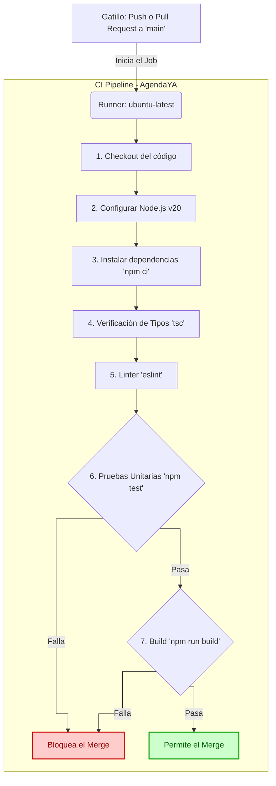

# AgendaYA - Grupo 7

Repositorio del proyecto **AgendaYA**, desarrollado para la cátedra de Ingeniería y Calidad de Software. Este repositorio contiene la implementación, lógica de negocio y pruebas automatizadas correspondientes a los módulos asignados al **Grupo 7**.

## Integrantes del Equipo

* Aciar Julián
* Carrillo Facundo
* Ferreira Luis
* Gallardo Juan
* Marchesi Mateo
* Reboredo Facundo
* Vega Nicolás

## Módulos Implementados

1.  **Módulo 03: Tipos de Evento**
    Gestión administrativa para la creación, edición, eliminación y visualización de los tipos de eventos (duración, modalidad, confirmación).
2.  **Módulo 04: Proceso de Reserva**
    Flujo del usuario invitado para la visualización de eventos disponibles, selección de fecha/hora, ingreso de datos personales y confirmación.

## Stack Tecnológico

* **Framework:** Next.js
* **Lenguaje:** TypeScript
* **Testing:** Jest
* **CI/CD:** GitHub Actions

## Instalación y Uso Local

Para levantar el proyecto y ejecutar las pruebas, sigue estos pasos:

1. **Clonar el repositorio:**
   ```bash
   git clone https://github.com/LuisFerre1ra/agenda-ya.git
   cd agenda-ya
   ```

    Instalar dependencias:
    ```bash
    npm install
    ```

    Ejecutar las pruebas unitarias:
    ```bash
    npm test
    ```

    Levantar el servidor de desarrollo:
    ```bash
    npm run dev
    ```

Pipeline de Integración Continua (CI)

Para garantizar la calidad del software, contamos con un pipeline configurado en GitHub Actions que se dispara automáticamente ante cada Push o Pull Request hacia la rama principal.

A continuación se detalla el esquema del flujo automatizado:

