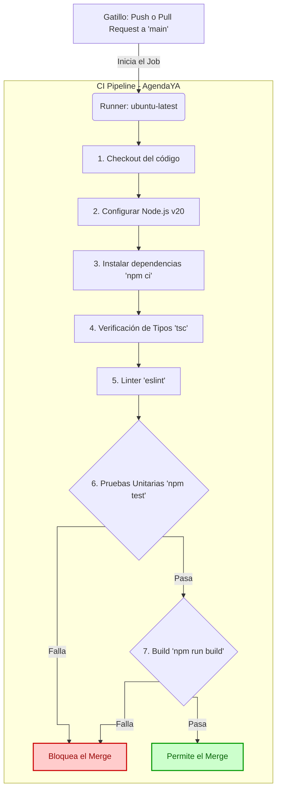

# AgendaYA - Grupo 7

Repositorio del proyecto **AgendaYA**, desarrollado para la cátedra de Ingeniería y Calidad de Software. Este repositorio contiene la implementación, lógica de negocio y pruebas automatizadas correspondientes a los módulos asignados al **Grupo 7**.

## Integrantes del Equipo

* Aciar Julián
* Carrillo Facundo
* Ferreira Luis
* García Joaquín
* Gallardo Juan
* Marchesi Mateo
* Reboredo Facundo
* Vega Nicolás

## Módulos y Flujos Implementados

El sistema implementa la capa de servicios, persistencia en memoria y la interfaz de usuario:

1. **Módulo 03: Tipos de Evento**
   - **Ruta:** `/tipos-de-evento`
   - **Flujos disponibles:**
     - **Creación:** Formulario modal para registrar nuevos tipos de eventos con validaciones de campos obligatorios y notificaciones emergentes.
     - **Edición:** Modificación de atributos de eventos existentes.
     - **Eliminación y Deshacer:** Diálogo modal de confirmación antes de la eliminación y ventana de contingencia de 5 segundos con opción de "Deshacer" para restaurar el registro.
     - **Búsqueda, Filtros y Ordenamiento:** Búsqueda reactiva en tiempo real, ordenamiento dinámico y filtrado.

2. **Módulo 04: Proceso de Reserva**
   - **Ruta:** `/reserva`
   - **Flujos disponibles:**
     - **Paso 1 (Selección de Evento):** Catálogo con el perfil del profesional y tarjetas de tipos de eventos disponibles.
     - **Paso 2 (Fecha y Franja Horaria):** Calendario interactivo mensual con cálculo de turnos libres y deshabilitación de horarios no disponibles.
     - **Paso 3 (Datos de Contacto):** Formulario de datos personales del invitado.
     - **Paso 4 (Resumen y Confirmación):** Vista consolidada de la cita para confirmación  y pantalla final de éxito.

## Stack Tecnológico

* **Framework:** Next.js
* **Lenguaje:** TypeScript
* **Estilos e Iconografía:** Tailwind CSS & Lucide Icons
* **Testing Unitario:** Jest & ts-jest
* **Testing End-to-End (E2E):** Cypress
* **CI/CD:** GitHub Actions

## Instalación y Uso Local

### 1. Prerrequisitos

- **Node.js:** Versión 20.x o superior recomendada.
- **npm:** Gestor de paquetes incluido con Node.js.
- **Git:** Para clonar el repositorio.

### 2. Clonar el repositorio

```bash
git clone https://github.com/LuisFerre1ra/agenda-ya.git
cd agenda-ya
```

### 3. Instalar dependencias

```bash
npm install
```

### 4. Levantar el servidor de desarrollo (Frontend)

Para iniciar el servidor local de Next.js:

```bash
npm run dev
```

La aplicación quedará disponible en [http://localhost:3000](http://localhost:3000). Se puede acceder a los siguientes flujos principales:
* **Módulo 03 (Tipos de Evento - Desktop):** [http://localhost:3000/tipos-de-evento](http://localhost:3000/tipos-de-evento)
* **Módulo 04 (Proceso de Reserva - Mobile):** [http://localhost:3000/reserva](http://localhost:3000/reserva)

---

## Ejecución de Pruebas Automatizadas

El proyecto dispone de suites de pruebas automatizadas tanto a nivel unitario como de extremo a extremo (E2E).

### Pruebas Unitarias (Jest)

- **Ejecutar todos los tests unitarios:**
  ```bash
  npm test
  ```
- **Ejecutar con reporte de cobertura:**
  ```bash
  npm test -- --coverage
  ```

### Pruebas End-to-End (Cypress)

> [!IMPORTANT]
> Antes de ejecutar las pruebas de Cypress, se debe tener el servidor frontend corriendo en **otra terminal**.

- **Modo interactivo (Cypress UI):**
  Abre la interfaz gráfica de Cypress para seleccionar el navegador y visualizar la ejecución de cada test paso a paso en tiempo real:
  ```bash
  npm run cypress:open
  ```
  *(Dentro de la ventana de Cypress, se selecciona **E2E Testing** y el navegador deseado).*

- **Modo headless (Consola / CI):**
  Ejecuta la totalidad de las suites E2E directamente en la terminal sin abrir navegador:
  ```bash
  npm run test:e2e
  ```
  *(Comando alternativo equivalente: `npm run cypress:run`)*

#### Suites de Pruebas E2E Implementadas
* **Módulo 03: Tipos de Evento**
  * `cypress/e2e/m03-creacion-evento.cy.ts`: Creación exitosa de tipos de evento y reflejo en grilla con notificación.
  * `cypress/e2e/m03-edicion-evento.cy.ts`: Edición y actualización de datos de un evento existente.
  * `cypress/e2e/m03-eliminacion-deshacer.cy.ts`: Flujo de eliminación con modal de confirmación y botón "Deshacer".
  * `cypress/e2e/m03-validacion-error.cy.ts`: Prevención de guardado con campos obligatorios vacíos o duraciones inválidas.
* **Módulo 04: Proceso de Reserva**
  * `cypress/e2e/m04-reserva-completa.cy.ts`: Flujo completo de reserva (Pasos 1 al 4) y pantalla de confirmación exitosa.
  * `cypress/e2e/m04-seleccion-horarios.cy.ts`: Interacción con el calendario mensual y selección de franjas horarias disponibles.
  * `cypress/e2e/m04-validacion-contacto.cy.ts`: Validaciones sintácticas de email y obligatoriedad en datos de contacto.
  * `cypress/e2e/m04-navegacion-retroceso.cy.ts`: Navegación hacia atrás entre pasos conservando los datos en memoria.

---

## Verificación de Calidad y Tipos

Para garantizar el estándar de calidad y consistencia del código antes de enviar commits o crear Pull Requests:

- **Análisis estático de código (ESLint):**
  ```bash
  npm run lint
  ```
- **Verificación estricta de tipos (TypeScript):**
  ```bash
  npx tsc --noEmit
  ```

---

## Pipeline de Integración Continua (CI)

Para garantizar la calidad del software, contamos con un pipeline configurado en GitHub Actions que se dispara automáticamente ante cada Push o Pull Request hacia la rama principal (`main`).

A continuación se detalla el esquema del flujo automatizado:


```mermaid
%%{init: {'flowchart': {'curve': 'stepAfter'}}}%%
flowchart TD
    A[Gatillo: Push o Pull Request a 'main'] -->|Inicia el Job| B(Runner: ubuntu-latest)
    
    subgraph Pipeline de CI [CI Pipeline - AgendaYA]
        B --> C[1. Checkout del código]
        C --> D[2. Configurar Node.js v20]
        D --> E[3. Instalar dependencias 'npm ci']
        E --> F[4. Verificación de Tipos 'tsc']
        F --> G[5. Linter 'eslint']
        G --> H{6. Pruebas Unitarias 'npm test'}
        
        H -->|Falla| ERROR[Bloquea el Merge]
        H -->|Pasa| I{7. Build 'npm run build'}
        
        I -->|Falla| ERROR
        I -->|Pasa| SUCCESS[Permite el Merge]

        style ERROR fill:#ffcccc,stroke:#cc0000,stroke-width:2px,color:#900
        style SUCCESS fill:#ccffcc,stroke:#009900,stroke-width:2px,color:#060
    end
```